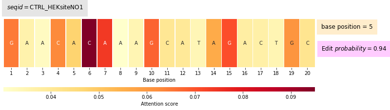
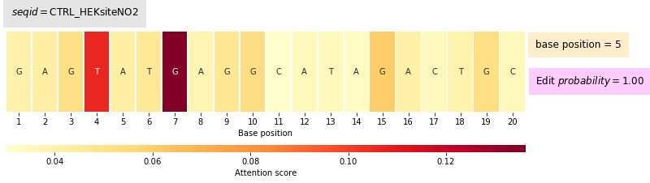

```python
%load_ext autoreload
%autoreload 2
```


```python
import os
import datetime
import numpy as np
import scipy
import pandas as pd
import torch
from torch import nn
import criscas
from criscas.utilities import create_directory, get_device, report_available_cuda_devices
from criscas.predict_model import *

```


```python
base_dir = os.path.abspath(os.path.join(os.getcwd(), os.pardir))
```

### Read sample data


```python
seq_df = pd.read_csv(os.path.join(base_dir, 'sample_data', 'abemax_sampledata.csv'), header=0)
```


```python
seq_df
```


<div>
<style scoped>
    .dataframe tbody tr th:only-of-type {
        vertical-align: middle;
    }

    .dataframe tbody tr th {
        vertical-align: top;
    }

    .dataframe thead th {
        text-align: right;
    }
</style>
<table border="1" class="dataframe">
  <thead>
    <tr style="text-align: right;">
      <th></th>
      <th>ID</th>
      <th>seq</th>
    </tr>
  </thead>
  <tbody>
    <tr>
      <th>0</th>
      <td>CTRL_HEKsiteNO18</td>
      <td>ACACACACACTTAGAATCTG</td>
    </tr>
    <tr>
      <th>1</th>
      <td>CTRL_RSF1NO2</td>
      <td>ACCCATTAAAGTTGAGGTGA</td>
    </tr>
    <tr>
      <th>2</th>
      <td>CTRL_EMX1NO2</td>
      <td>AGATTTATGCAAACGGGTTG</td>
    </tr>
    <tr>
      <th>3</th>
      <td>CTRL_FANCFNO3</td>
      <td>AGCGGCGGCTGCACAACCAG</td>
    </tr>
    <tr>
      <th>4</th>
      <td>CTRL_FANCFNO5</td>
      <td>AGGCCCGGCGCACGGTGGCG</td>
    </tr>
    <tr>
      <th>5</th>
      <td>CTRL_TARDBPNO2</td>
      <td>CGGGAGTTCTTCTCTCAGTA</td>
    </tr>
    <tr>
      <th>6</th>
      <td>CTRL_HEKsiteNO1</td>
      <td>GAACACAAAGCATAGACTGC</td>
    </tr>
    <tr>
      <th>7</th>
      <td>CTRL_HEKsiteNO9</td>
      <td>GAAGACCAAGGATAGACTGC</td>
    </tr>
    <tr>
      <th>8</th>
      <td>CTRL_HEKsiteNO2</td>
      <td>GAGTATGAGGCATAGACTGC</td>
    </tr>
    <tr>
      <th>9</th>
      <td>CTRL_EMX1NO1</td>
      <td>GAGTCCGAGCAGAAGAAGAA</td>
    </tr>
    <tr>
      <th>10</th>
      <td>HEKsite7LV</td>
      <td>GATATTGATACAAAATGGGG</td>
    </tr>
    <tr>
      <th>11</th>
      <td>CTRL_HEKsiteNO11</td>
      <td>GGACAGGCAGCATAGACTGT</td>
    </tr>
    <tr>
      <th>12</th>
      <td>CTRL_HEKsiteNO14</td>
      <td>GGCTAAAGACCATAGACTGT</td>
    </tr>
    <tr>
      <th>13</th>
      <td>CTRL_HEKsiteNO8</td>
      <td>GTAAACAAAGCATAGACTGA</td>
    </tr>
    <tr>
      <th>14</th>
      <td>CTRL_HEKsiteNO3</td>
      <td>GTCAAGAAAGCAGAGACTGC</td>
    </tr>
    <tr>
      <th>15</th>
      <td>CTRL_DOCK3NO2</td>
      <td>TAAGACTGAACAAGAATGGT</td>
    </tr>
    <tr>
      <th>16</th>
      <td>CTRL_ZNF212NO1</td>
      <td>TGCACCTGGCATCAACACGG</td>
    </tr>
    <tr>
      <th>17</th>
      <td>CTRL_NEK1NO2</td>
      <td>TGGCTCTCTCTACATAGTAA</td>
    </tr>
  </tbody>
</table>
</div>


The models expect sequences (i.e. target sites) to be wrapped in a `pandas.DataFrame` with a header that includes `ID` of the sequence and `seq` columns.
The sequences should be of length 20 (i.e. 20 bases) and represent the protospacer target site.


```python
# create a directory where we dump the predictions of the models
csv_dir = create_directory(os.path.join(base_dir, 'sample_data', 'predictions'))
```

### Specify device (i.e. CPU or GPU) to run the models on

Specify device to run the model on. The models can run on `GPU` or `CPU`. We can instantiate a device by running `get_device(to_gpu,gpu_index)` function. 

- To run on GPU we pass `to_gpu = True` and specify which card to use if we have multiple cards `gpu_index=int` (i.e. in case we have multiple GPU cards we specify the index counting from 0). 
- If there is no GPU installed, the function will return a `CPU` device.

We can get a detailed information on the GPU cards installed on the compute node by calling `report_available_cuda_devices` function.


```python
report_available_cuda_devices()
```

    number of GPUs available: 1
    cuda:0, name:Tesla P4
    total memory available: 7.43353271484375 GB
    total memory allocated on device: 0.0 GB
    max memory allocated on device: 0.0 GB
    total memory cached on device: 0.0 GB
    max memory cached  on device: 0.0 GB
    


```python
# instantiate a device using the only one available :P
device = get_device(True, 0)
device
```


    device(type='cuda', index=0)


### Create a BE-DICT model by sepcifying the target base editor 

We start `BE-DICT` model by calling `BEDICT_CriscasModel(base_editor, device)` where we specify which base editor to use (i.e. `ABEmax`, `BE4`, `ABE8e`, `AID`) and the `device` we create earlier to run on.


```python
base_editor = 'ABEmax'
bedict = BEDICT_CriscasModel(base_editor, device)
```

We generate predictions by calling `predict_from_dataframe(seq_df)` where we pass the data frame wrapping the target sequences. The function returns two objects:

- `pred_w_attn_runs_df` which is a data frame that contains predictions per target base and the attentions scores across all positions.

- `proc_df` which is a data frame that represents the processed sequence data frame we passed (i.e. `seq_df`)


```python
pred_w_attn_runs_df, proc_df = bedict.predict_from_dataframe(seq_df)
```

    --- processing input data frame ---
    --- creating datatensor ---
    --- building model ---
    --- loading trained model ---
    /mnt/orisenbazuru/crispr/ABEmax/train_val/run_0
    running prediction for base_editor: ABEmax | run_num: 0
    --- loading trained model ---
    /mnt/orisenbazuru/crispr/ABEmax/train_val/run_1
    running prediction for base_editor: ABEmax | run_num: 1
    --- loading trained model ---
    /mnt/orisenbazuru/crispr/ABEmax/train_val/run_2
    running prediction for base_editor: ABEmax | run_num: 2
    --- loading trained model ---
    /mnt/orisenbazuru/crispr/ABEmax/train_val/run_3
    running prediction for base_editor: ABEmax | run_num: 3
    --- loading trained model ---
    /mnt/orisenbazuru/crispr/ABEmax/train_val/run_4
    running prediction for base_editor: ABEmax | run_num: 4


`pred_w_attn_runs_df` contains predictions from 5 trained models for `ABEmax` base editor (we have 5 runs trained per base editor). For more info, see our [paper](https://www.biorxiv.org/content/10.1101/2020.07.05.186544v1) on biorxiv.

Target positions in the sequence reported in `base_pos` column in `pred_w_attn_runs_df` uses 0-based indexing (i.e. 0-19)


```python
pred_w_attn_runs_df
```


<div>
<style scoped>
    .dataframe tbody tr th:only-of-type {
        vertical-align: middle;
    }

    .dataframe tbody tr th {
        vertical-align: top;
    }

    .dataframe thead th {
        text-align: right;
    }
</style>
<table border="1" class="dataframe">
  <thead>
    <tr style="text-align: right;">
      <th></th>
      <th>id</th>
      <th>base_pos</th>
      <th>prob_score_class0</th>
      <th>prob_score_class1</th>
      <th>Attn0</th>
      <th>Attn1</th>
      <th>Attn2</th>
      <th>Attn3</th>
      <th>Attn4</th>
      <th>Attn5</th>
      <th>...</th>
      <th>Attn12</th>
      <th>Attn13</th>
      <th>Attn14</th>
      <th>Attn15</th>
      <th>Attn16</th>
      <th>Attn17</th>
      <th>Attn18</th>
      <th>Attn19</th>
      <th>run_id</th>
      <th>model_name</th>
    </tr>
  </thead>
  <tbody>
    <tr>
      <th>0</th>
      <td>CTRL_HEKsiteNO18</td>
      <td>0</td>
      <td>0.999709</td>
      <td>0.000291</td>
      <td>0.014348</td>
      <td>0.048338</td>
      <td>0.016288</td>
      <td>0.045720</td>
      <td>0.019116</td>
      <td>0.145056</td>
      <td>...</td>
      <td>0.015412</td>
      <td>0.058490</td>
      <td>0.016998</td>
      <td>0.016465</td>
      <td>0.059028</td>
      <td>0.067713</td>
      <td>0.067285</td>
      <td>0.112856</td>
      <td>run_0</td>
      <td>ABEmax</td>
    </tr>
    <tr>
      <th>1</th>
      <td>CTRL_HEKsiteNO18</td>
      <td>2</td>
      <td>0.969998</td>
      <td>0.030002</td>
      <td>0.044013</td>
      <td>0.051574</td>
      <td>0.045433</td>
      <td>0.046578</td>
      <td>0.047672</td>
      <td>0.052783</td>
      <td>...</td>
      <td>0.045638</td>
      <td>0.063682</td>
      <td>0.046986</td>
      <td>0.046125</td>
      <td>0.041857</td>
      <td>0.060863</td>
      <td>0.043291</td>
      <td>0.065565</td>
      <td>run_0</td>
      <td>ABEmax</td>
    </tr>
    <tr>
      <th>2</th>
      <td>CTRL_HEKsiteNO18</td>
      <td>4</td>
      <td>0.054098</td>
      <td>0.945902</td>
      <td>0.094093</td>
      <td>0.022711</td>
      <td>0.106497</td>
      <td>0.016641</td>
      <td>0.100571</td>
      <td>0.008621</td>
      <td>...</td>
      <td>0.091655</td>
      <td>0.018518</td>
      <td>0.080573</td>
      <td>0.097054</td>
      <td>0.024016</td>
      <td>0.016480</td>
      <td>0.024753</td>
      <td>0.012796</td>
      <td>run_0</td>
      <td>ABEmax</td>
    </tr>
    <tr>
      <th>3</th>
      <td>CTRL_HEKsiteNO18</td>
      <td>6</td>
      <td>0.900246</td>
      <td>0.099754</td>
      <td>0.059951</td>
      <td>0.058985</td>
      <td>0.053788</td>
      <td>0.062632</td>
      <td>0.034886</td>
      <td>0.026394</td>
      <td>...</td>
      <td>0.075368</td>
      <td>0.065085</td>
      <td>0.059768</td>
      <td>0.045221</td>
      <td>0.038758</td>
      <td>0.065427</td>
      <td>0.031523</td>
      <td>0.038408</td>
      <td>run_0</td>
      <td>ABEmax</td>
    </tr>
    <tr>
      <th>4</th>
      <td>CTRL_HEKsiteNO18</td>
      <td>8</td>
      <td>0.942768</td>
      <td>0.057232</td>
      <td>0.056051</td>
      <td>0.052924</td>
      <td>0.050032</td>
      <td>0.050167</td>
      <td>0.042835</td>
      <td>0.047317</td>
      <td>...</td>
      <td>0.057728</td>
      <td>0.040145</td>
      <td>0.062497</td>
      <td>0.056194</td>
      <td>0.046561</td>
      <td>0.056434</td>
      <td>0.047548</td>
      <td>0.044195</td>
      <td>run_0</td>
      <td>ABEmax</td>
    </tr>
    <tr>
      <th>...</th>
      <td>...</td>
      <td>...</td>
      <td>...</td>
      <td>...</td>
      <td>...</td>
      <td>...</td>
      <td>...</td>
      <td>...</td>
      <td>...</td>
      <td>...</td>
      <td>...</td>
      <td>...</td>
      <td>...</td>
      <td>...</td>
      <td>...</td>
      <td>...</td>
      <td>...</td>
      <td>...</td>
      <td>...</td>
      <td>...</td>
      <td>...</td>
    </tr>
    <tr>
      <th>600</th>
      <td>CTRL_NEK1NO2</td>
      <td>11</td>
      <td>0.932266</td>
      <td>0.067734</td>
      <td>0.037136</td>
      <td>0.028478</td>
      <td>0.025359</td>
      <td>0.033689</td>
      <td>0.023968</td>
      <td>0.029764</td>
      <td>...</td>
      <td>0.035961</td>
      <td>0.089764</td>
      <td>0.045710</td>
      <td>0.100809</td>
      <td>0.028398</td>
      <td>0.054071</td>
      <td>0.105752</td>
      <td>0.106517</td>
      <td>run_4</td>
      <td>ABEmax</td>
    </tr>
    <tr>
      <th>601</th>
      <td>CTRL_NEK1NO2</td>
      <td>13</td>
      <td>0.981487</td>
      <td>0.018513</td>
      <td>0.026479</td>
      <td>0.023668</td>
      <td>0.022043</td>
      <td>0.029213</td>
      <td>0.019680</td>
      <td>0.022027</td>
      <td>...</td>
      <td>0.042398</td>
      <td>0.105321</td>
      <td>0.039242</td>
      <td>0.110279</td>
      <td>0.024772</td>
      <td>0.044570</td>
      <td>0.128229</td>
      <td>0.111295</td>
      <td>run_4</td>
      <td>ABEmax</td>
    </tr>
    <tr>
      <th>602</th>
      <td>CTRL_NEK1NO2</td>
      <td>15</td>
      <td>0.971135</td>
      <td>0.028865</td>
      <td>0.027017</td>
      <td>0.022021</td>
      <td>0.021272</td>
      <td>0.039477</td>
      <td>0.019656</td>
      <td>0.026146</td>
      <td>...</td>
      <td>0.051267</td>
      <td>0.101809</td>
      <td>0.036415</td>
      <td>0.106422</td>
      <td>0.023323</td>
      <td>0.044532</td>
      <td>0.119506</td>
      <td>0.106190</td>
      <td>run_4</td>
      <td>ABEmax</td>
    </tr>
    <tr>
      <th>603</th>
      <td>CTRL_NEK1NO2</td>
      <td>18</td>
      <td>0.999837</td>
      <td>0.000163</td>
      <td>0.010452</td>
      <td>0.007225</td>
      <td>0.006333</td>
      <td>0.011724</td>
      <td>0.005224</td>
      <td>0.008501</td>
      <td>...</td>
      <td>0.017740</td>
      <td>0.146858</td>
      <td>0.018357</td>
      <td>0.162922</td>
      <td>0.007708</td>
      <td>0.026476</td>
      <td>0.179829</td>
      <td>0.166394</td>
      <td>run_4</td>
      <td>ABEmax</td>
    </tr>
    <tr>
      <th>604</th>
      <td>CTRL_NEK1NO2</td>
      <td>19</td>
      <td>0.999848</td>
      <td>0.000152</td>
      <td>0.011051</td>
      <td>0.006412</td>
      <td>0.005446</td>
      <td>0.009563</td>
      <td>0.004693</td>
      <td>0.007176</td>
      <td>...</td>
      <td>0.017580</td>
      <td>0.151383</td>
      <td>0.021056</td>
      <td>0.167686</td>
      <td>0.006872</td>
      <td>0.028687</td>
      <td>0.174202</td>
      <td>0.168627</td>
      <td>run_4</td>
      <td>ABEmax</td>
    </tr>
  </tbody>
</table>
<p>605 rows × 26 columns</p>
</div>


```python
proc_df
```


<div>
<style scoped>
    .dataframe tbody tr th:only-of-type {
        vertical-align: middle;
    }

    .dataframe tbody tr th {
        vertical-align: top;
    }

    .dataframe thead th {
        text-align: right;
    }
</style>
<table border="1" class="dataframe">
  <thead>
    <tr style="text-align: right;">
      <th></th>
      <th>index</th>
      <th>M1</th>
      <th>M2</th>
      <th>M3</th>
      <th>M4</th>
      <th>M5</th>
      <th>M6</th>
      <th>M7</th>
      <th>M8</th>
      <th>M9</th>
      <th>...</th>
      <th>B11</th>
      <th>B12</th>
      <th>B13</th>
      <th>B14</th>
      <th>B15</th>
      <th>B16</th>
      <th>B17</th>
      <th>B18</th>
      <th>B19</th>
      <th>B20</th>
    </tr>
  </thead>
  <tbody>
    <tr>
      <th>0</th>
      <td>0</td>
      <td>1</td>
      <td>0</td>
      <td>1</td>
      <td>0</td>
      <td>1</td>
      <td>0</td>
      <td>1</td>
      <td>0</td>
      <td>1</td>
      <td>...</td>
      <td>2</td>
      <td>2</td>
      <td>0</td>
      <td>3</td>
      <td>0</td>
      <td>0</td>
      <td>2</td>
      <td>1</td>
      <td>2</td>
      <td>3</td>
    </tr>
    <tr>
      <th>1</th>
      <td>1</td>
      <td>1</td>
      <td>0</td>
      <td>0</td>
      <td>0</td>
      <td>1</td>
      <td>0</td>
      <td>0</td>
      <td>1</td>
      <td>1</td>
      <td>...</td>
      <td>3</td>
      <td>2</td>
      <td>2</td>
      <td>3</td>
      <td>0</td>
      <td>3</td>
      <td>3</td>
      <td>2</td>
      <td>3</td>
      <td>0</td>
    </tr>
    <tr>
      <th>2</th>
      <td>2</td>
      <td>1</td>
      <td>0</td>
      <td>1</td>
      <td>0</td>
      <td>0</td>
      <td>0</td>
      <td>1</td>
      <td>0</td>
      <td>0</td>
      <td>...</td>
      <td>0</td>
      <td>0</td>
      <td>0</td>
      <td>1</td>
      <td>3</td>
      <td>3</td>
      <td>3</td>
      <td>2</td>
      <td>2</td>
      <td>3</td>
    </tr>
    <tr>
      <th>3</th>
      <td>3</td>
      <td>1</td>
      <td>0</td>
      <td>0</td>
      <td>0</td>
      <td>0</td>
      <td>0</td>
      <td>0</td>
      <td>0</td>
      <td>0</td>
      <td>...</td>
      <td>3</td>
      <td>1</td>
      <td>0</td>
      <td>1</td>
      <td>0</td>
      <td>0</td>
      <td>1</td>
      <td>1</td>
      <td>0</td>
      <td>3</td>
    </tr>
    <tr>
      <th>4</th>
      <td>4</td>
      <td>1</td>
      <td>0</td>
      <td>0</td>
      <td>0</td>
      <td>0</td>
      <td>0</td>
      <td>0</td>
      <td>0</td>
      <td>0</td>
      <td>...</td>
      <td>1</td>
      <td>0</td>
      <td>1</td>
      <td>3</td>
      <td>3</td>
      <td>2</td>
      <td>3</td>
      <td>3</td>
      <td>1</td>
      <td>3</td>
    </tr>
    <tr>
      <th>5</th>
      <td>5</td>
      <td>0</td>
      <td>0</td>
      <td>0</td>
      <td>0</td>
      <td>1</td>
      <td>0</td>
      <td>0</td>
      <td>0</td>
      <td>0</td>
      <td>...</td>
      <td>2</td>
      <td>1</td>
      <td>2</td>
      <td>1</td>
      <td>2</td>
      <td>1</td>
      <td>0</td>
      <td>3</td>
      <td>2</td>
      <td>0</td>
    </tr>
    <tr>
      <th>6</th>
      <td>6</td>
      <td>0</td>
      <td>1</td>
      <td>1</td>
      <td>0</td>
      <td>1</td>
      <td>0</td>
      <td>1</td>
      <td>1</td>
      <td>1</td>
      <td>...</td>
      <td>1</td>
      <td>0</td>
      <td>2</td>
      <td>0</td>
      <td>3</td>
      <td>0</td>
      <td>1</td>
      <td>2</td>
      <td>3</td>
      <td>1</td>
    </tr>
    <tr>
      <th>7</th>
      <td>7</td>
      <td>0</td>
      <td>1</td>
      <td>1</td>
      <td>0</td>
      <td>1</td>
      <td>0</td>
      <td>0</td>
      <td>1</td>
      <td>1</td>
      <td>...</td>
      <td>3</td>
      <td>0</td>
      <td>2</td>
      <td>0</td>
      <td>3</td>
      <td>0</td>
      <td>1</td>
      <td>2</td>
      <td>3</td>
      <td>1</td>
    </tr>
    <tr>
      <th>8</th>
      <td>8</td>
      <td>0</td>
      <td>1</td>
      <td>0</td>
      <td>0</td>
      <td>1</td>
      <td>0</td>
      <td>0</td>
      <td>1</td>
      <td>0</td>
      <td>...</td>
      <td>1</td>
      <td>0</td>
      <td>2</td>
      <td>0</td>
      <td>3</td>
      <td>0</td>
      <td>1</td>
      <td>2</td>
      <td>3</td>
      <td>1</td>
    </tr>
    <tr>
      <th>9</th>
      <td>9</td>
      <td>0</td>
      <td>1</td>
      <td>0</td>
      <td>0</td>
      <td>0</td>
      <td>0</td>
      <td>0</td>
      <td>1</td>
      <td>0</td>
      <td>...</td>
      <td>0</td>
      <td>3</td>
      <td>0</td>
      <td>0</td>
      <td>3</td>
      <td>0</td>
      <td>0</td>
      <td>3</td>
      <td>0</td>
      <td>0</td>
    </tr>
    <tr>
      <th>10</th>
      <td>10</td>
      <td>0</td>
      <td>1</td>
      <td>0</td>
      <td>1</td>
      <td>0</td>
      <td>0</td>
      <td>0</td>
      <td>1</td>
      <td>0</td>
      <td>...</td>
      <td>1</td>
      <td>0</td>
      <td>0</td>
      <td>0</td>
      <td>0</td>
      <td>2</td>
      <td>3</td>
      <td>3</td>
      <td>3</td>
      <td>3</td>
    </tr>
    <tr>
      <th>11</th>
      <td>11</td>
      <td>0</td>
      <td>0</td>
      <td>1</td>
      <td>0</td>
      <td>1</td>
      <td>0</td>
      <td>0</td>
      <td>0</td>
      <td>1</td>
      <td>...</td>
      <td>1</td>
      <td>0</td>
      <td>2</td>
      <td>0</td>
      <td>3</td>
      <td>0</td>
      <td>1</td>
      <td>2</td>
      <td>3</td>
      <td>2</td>
    </tr>
    <tr>
      <th>12</th>
      <td>12</td>
      <td>0</td>
      <td>0</td>
      <td>0</td>
      <td>0</td>
      <td>1</td>
      <td>1</td>
      <td>1</td>
      <td>0</td>
      <td>1</td>
      <td>...</td>
      <td>1</td>
      <td>0</td>
      <td>2</td>
      <td>0</td>
      <td>3</td>
      <td>0</td>
      <td>1</td>
      <td>2</td>
      <td>3</td>
      <td>2</td>
    </tr>
    <tr>
      <th>13</th>
      <td>13</td>
      <td>0</td>
      <td>0</td>
      <td>1</td>
      <td>1</td>
      <td>1</td>
      <td>0</td>
      <td>1</td>
      <td>1</td>
      <td>1</td>
      <td>...</td>
      <td>1</td>
      <td>0</td>
      <td>2</td>
      <td>0</td>
      <td>3</td>
      <td>0</td>
      <td>1</td>
      <td>2</td>
      <td>3</td>
      <td>0</td>
    </tr>
    <tr>
      <th>14</th>
      <td>14</td>
      <td>0</td>
      <td>0</td>
      <td>0</td>
      <td>1</td>
      <td>1</td>
      <td>0</td>
      <td>1</td>
      <td>1</td>
      <td>1</td>
      <td>...</td>
      <td>1</td>
      <td>0</td>
      <td>3</td>
      <td>0</td>
      <td>3</td>
      <td>0</td>
      <td>1</td>
      <td>2</td>
      <td>3</td>
      <td>1</td>
    </tr>
    <tr>
      <th>15</th>
      <td>15</td>
      <td>0</td>
      <td>1</td>
      <td>1</td>
      <td>0</td>
      <td>1</td>
      <td>0</td>
      <td>0</td>
      <td>0</td>
      <td>1</td>
      <td>...</td>
      <td>1</td>
      <td>0</td>
      <td>0</td>
      <td>3</td>
      <td>0</td>
      <td>0</td>
      <td>2</td>
      <td>3</td>
      <td>3</td>
      <td>2</td>
    </tr>
    <tr>
      <th>16</th>
      <td>16</td>
      <td>0</td>
      <td>0</td>
      <td>0</td>
      <td>1</td>
      <td>0</td>
      <td>0</td>
      <td>0</td>
      <td>0</td>
      <td>0</td>
      <td>...</td>
      <td>0</td>
      <td>2</td>
      <td>1</td>
      <td>0</td>
      <td>0</td>
      <td>1</td>
      <td>0</td>
      <td>1</td>
      <td>3</td>
      <td>3</td>
    </tr>
    <tr>
      <th>17</th>
      <td>17</td>
      <td>0</td>
      <td>0</td>
      <td>0</td>
      <td>0</td>
      <td>0</td>
      <td>0</td>
      <td>0</td>
      <td>0</td>
      <td>0</td>
      <td>...</td>
      <td>2</td>
      <td>0</td>
      <td>1</td>
      <td>0</td>
      <td>2</td>
      <td>0</td>
      <td>3</td>
      <td>2</td>
      <td>0</td>
      <td>0</td>
    </tr>
  </tbody>
</table>
<p>18 rows × 64 columns</p>
</div>


Given that we have 5 predictions per sequence, we can further reduce to one prediction by either `averaging` across all models, or taking the `median` or `max` prediction based on the probability of editing scores. For this we use `select_prediction(pred_w_attn_runs_df, pred_option)` where `pred_w_attn_runs_df` is the data frame containing predictions from 5 models for each sequence. `pred_option` can be assume one of {`mean`, `median`, `max`}.


```python
pred_option = 'mean'
pred_w_attn_df = bedict.select_prediction(pred_w_attn_runs_df, pred_option)
```


```python
pred_w_attn_df
```


<div>
<style scoped>
    .dataframe tbody tr th:only-of-type {
        vertical-align: middle;
    }

    .dataframe tbody tr th {
        vertical-align: top;
    }

    .dataframe thead th {
        text-align: right;
    }
</style>
<table border="1" class="dataframe">
  <thead>
    <tr style="text-align: right;">
      <th></th>
      <th>id</th>
      <th>base_pos</th>
      <th>model_name</th>
      <th>prob_score_class0</th>
      <th>prob_score_class1</th>
      <th>Attn0</th>
      <th>Attn1</th>
      <th>Attn2</th>
      <th>Attn3</th>
      <th>Attn4</th>
      <th>...</th>
      <th>Attn10</th>
      <th>Attn11</th>
      <th>Attn12</th>
      <th>Attn13</th>
      <th>Attn14</th>
      <th>Attn15</th>
      <th>Attn16</th>
      <th>Attn17</th>
      <th>Attn18</th>
      <th>Attn19</th>
    </tr>
  </thead>
  <tbody>
    <tr>
      <th>0</th>
      <td>CTRL_DOCK3NO2</td>
      <td>1</td>
      <td>ABEmax</td>
      <td>0.999694</td>
      <td>0.000306</td>
      <td>0.055954</td>
      <td>0.083920</td>
      <td>0.055398</td>
      <td>0.029273</td>
      <td>0.066976</td>
      <td>...</td>
      <td>0.037371</td>
      <td>0.050351</td>
      <td>0.065975</td>
      <td>0.021177</td>
      <td>0.045780</td>
      <td>0.042680</td>
      <td>0.054392</td>
      <td>0.024797</td>
      <td>0.023750</td>
      <td>0.059522</td>
    </tr>
    <tr>
      <th>1</th>
      <td>CTRL_DOCK3NO2</td>
      <td>2</td>
      <td>ABEmax</td>
      <td>0.989257</td>
      <td>0.010743</td>
      <td>0.064059</td>
      <td>0.057217</td>
      <td>0.053120</td>
      <td>0.035647</td>
      <td>0.044787</td>
      <td>...</td>
      <td>0.045017</td>
      <td>0.050953</td>
      <td>0.058711</td>
      <td>0.039909</td>
      <td>0.050422</td>
      <td>0.054270</td>
      <td>0.055203</td>
      <td>0.040105</td>
      <td>0.038902</td>
      <td>0.063045</td>
    </tr>
    <tr>
      <th>2</th>
      <td>CTRL_DOCK3NO2</td>
      <td>4</td>
      <td>ABEmax</td>
      <td>0.027801</td>
      <td>0.972199</td>
      <td>0.041073</td>
      <td>0.035965</td>
      <td>0.036837</td>
      <td>0.092211</td>
      <td>0.057230</td>
      <td>...</td>
      <td>0.042532</td>
      <td>0.042859</td>
      <td>0.039368</td>
      <td>0.059361</td>
      <td>0.045379</td>
      <td>0.042745</td>
      <td>0.036643</td>
      <td>0.054618</td>
      <td>0.052010</td>
      <td>0.031465</td>
    </tr>
    <tr>
      <th>3</th>
      <td>CTRL_DOCK3NO2</td>
      <td>8</td>
      <td>ABEmax</td>
      <td>0.963844</td>
      <td>0.036156</td>
      <td>0.054455</td>
      <td>0.058288</td>
      <td>0.061597</td>
      <td>0.045540</td>
      <td>0.049391</td>
      <td>...</td>
      <td>0.056765</td>
      <td>0.042308</td>
      <td>0.052514</td>
      <td>0.040530</td>
      <td>0.044223</td>
      <td>0.043556</td>
      <td>0.055404</td>
      <td>0.044196</td>
      <td>0.042889</td>
      <td>0.052508</td>
    </tr>
    <tr>
      <th>4</th>
      <td>CTRL_DOCK3NO2</td>
      <td>9</td>
      <td>ABEmax</td>
      <td>0.964455</td>
      <td>0.035545</td>
      <td>0.060099</td>
      <td>0.051905</td>
      <td>0.052061</td>
      <td>0.042245</td>
      <td>0.046554</td>
      <td>...</td>
      <td>0.047225</td>
      <td>0.047182</td>
      <td>0.053338</td>
      <td>0.040756</td>
      <td>0.045651</td>
      <td>0.047976</td>
      <td>0.057891</td>
      <td>0.042012</td>
      <td>0.042788</td>
      <td>0.059181</td>
    </tr>
    <tr>
      <th>...</th>
      <td>...</td>
      <td>...</td>
      <td>...</td>
      <td>...</td>
      <td>...</td>
      <td>...</td>
      <td>...</td>
      <td>...</td>
      <td>...</td>
      <td>...</td>
      <td>...</td>
      <td>...</td>
      <td>...</td>
      <td>...</td>
      <td>...</td>
      <td>...</td>
      <td>...</td>
      <td>...</td>
      <td>...</td>
      <td>...</td>
      <td>...</td>
    </tr>
    <tr>
      <th>116</th>
      <td>HEKsite7LV</td>
      <td>9</td>
      <td>ABEmax</td>
      <td>0.953404</td>
      <td>0.046596</td>
      <td>0.041823</td>
      <td>0.054237</td>
      <td>0.053839</td>
      <td>0.056258</td>
      <td>0.055267</td>
      <td>...</td>
      <td>0.046256</td>
      <td>0.060901</td>
      <td>0.056168</td>
      <td>0.063735</td>
      <td>0.057009</td>
      <td>0.046230</td>
      <td>0.040330</td>
      <td>0.038969</td>
      <td>0.038606</td>
      <td>0.041079</td>
    </tr>
    <tr>
      <th>117</th>
      <td>HEKsite7LV</td>
      <td>11</td>
      <td>ABEmax</td>
      <td>0.984208</td>
      <td>0.015792</td>
      <td>0.038248</td>
      <td>0.060556</td>
      <td>0.055879</td>
      <td>0.057153</td>
      <td>0.060245</td>
      <td>...</td>
      <td>0.038827</td>
      <td>0.057368</td>
      <td>0.060292</td>
      <td>0.062552</td>
      <td>0.056298</td>
      <td>0.045405</td>
      <td>0.038160</td>
      <td>0.037091</td>
      <td>0.037129</td>
      <td>0.039475</td>
    </tr>
    <tr>
      <th>118</th>
      <td>HEKsite7LV</td>
      <td>12</td>
      <td>ABEmax</td>
      <td>0.971138</td>
      <td>0.028861</td>
      <td>0.038344</td>
      <td>0.062133</td>
      <td>0.055802</td>
      <td>0.055266</td>
      <td>0.059578</td>
      <td>...</td>
      <td>0.042988</td>
      <td>0.059114</td>
      <td>0.058590</td>
      <td>0.058951</td>
      <td>0.053746</td>
      <td>0.042383</td>
      <td>0.038534</td>
      <td>0.039799</td>
      <td>0.047740</td>
      <td>0.043094</td>
    </tr>
    <tr>
      <th>119</th>
      <td>HEKsite7LV</td>
      <td>13</td>
      <td>ABEmax</td>
      <td>0.993313</td>
      <td>0.006688</td>
      <td>0.031807</td>
      <td>0.060500</td>
      <td>0.055020</td>
      <td>0.062529</td>
      <td>0.073104</td>
      <td>...</td>
      <td>0.039236</td>
      <td>0.063207</td>
      <td>0.061411</td>
      <td>0.063863</td>
      <td>0.058263</td>
      <td>0.041553</td>
      <td>0.032167</td>
      <td>0.029491</td>
      <td>0.031877</td>
      <td>0.032881</td>
    </tr>
    <tr>
      <th>120</th>
      <td>HEKsite7LV</td>
      <td>14</td>
      <td>ABEmax</td>
      <td>0.966918</td>
      <td>0.033083</td>
      <td>0.034673</td>
      <td>0.063903</td>
      <td>0.054013</td>
      <td>0.056421</td>
      <td>0.058965</td>
      <td>...</td>
      <td>0.041977</td>
      <td>0.060813</td>
      <td>0.059549</td>
      <td>0.068043</td>
      <td>0.055832</td>
      <td>0.043389</td>
      <td>0.034759</td>
      <td>0.037584</td>
      <td>0.037797</td>
      <td>0.036875</td>
    </tr>
  </tbody>
</table>
<p>121 rows × 25 columns</p>
</div>


We can dump the prediction results on a specified directory on disk. We will dump the predictions with all 5 runs `pred_w_attn_runs_df` and the one average across runs `pred_w_attn_df`.

Under `sample_data` directory we will have the following tree:

```shell
sample_data
└── predictions
    ├── predictions_allruns.csv
    └── predictions_predoption_mean.csv
```


```python
pred_w_attn_runs_df.to_csv(os.path.join(csv_dir, f'predictions_allruns.csv'))
```


```python
pred_w_attn_df.to_csv(os.path.join(csv_dir, f'predictions_predoption_{pred_option}.csv'))
```

### Generate attention plots

We can generate attention plots for the prediction of each target base in the sequence using `highlight_attn_per_seq` method that takes the following arguments:

- `pred_w_attn_runs_df`: data frame that contains model's predictions (5 runs) for each target base of each sequence (see above).
- `proc_df`: data frame that represents the processed sequence data frame we passed (i.e. seq_df)
- `seqid_pos_map`: dictionary `{seq_id:list of positions}` where `seq_id` is the ID of the target sequence, and list of positions that we want to generate attention plots for. Users can specify a `position from 1 to 20` (i.e. length of protospacer sequence)
- `pred_option`: selection option for aggregating across 5 models' predictions. That is we can average the predictions across 5 runs, or take `max`, `median`, `min` or `None` (i.e. keep all 5 runs) 
- `apply_attnscore_filter`: boolean (`True` or `False`) to further apply filtering on the generated attention scores. This filtering allow to plot only predictions where the associated attention scores have a maximum that is >= 3 times the base attention score value <=> (3 * 1/20)
- `fig_dir`: directory where to dump the generated plots or `None` (to return the plots inline)


```python
# create a dictionary to specify target sequence and the position I want attention plot for
# we are targeting position 5 in the sequence
seqid_pos_map = {'CTRL_HEKsiteNO1':[5], 'CTRL_HEKsiteNO2':[5]}
pred_option = 'mean'
apply_attn_filter = False
bedict.highlight_attn_per_seq(pred_w_attn_runs_df, 
                              proc_df,
                              seqid_pos_map=seqid_pos_map,
                              pred_option=pred_option, 
                              apply_attnscore_filter=apply_attn_filter, 
                              fig_dir=None)
```

    highlighting seqid:CTRL_HEKsiteNO1, pos:5
    highlighting seqid:CTRL_HEKsiteNO2, pos:5








We can save the plots on disk without returning them by specifing `fig_dir`


```python
# create a dictionary to specify target sequence and the position I want attention plot for
# we are targeting position 5 in the sequence
seqid_pos_map = {'CTRL_HEKsiteNO1':[5], 'CTRL_HEKsiteNO2':[5]}
pred_option = 'mean'
apply_attn_filter = False
fig_dir =  create_directory(os.path.join(base_dir, 'sample_data', 'fig_dir'))
bedict.highlight_attn_per_seq(pred_w_attn_runs_df, 
                              proc_df,
                              seqid_pos_map=seqid_pos_map,
                              pred_option=pred_option, 
                              apply_attnscore_filter=apply_attn_filter, 
                              fig_dir=create_directory(os.path.join(fig_dir, pred_option)))
```

    highlighting seqid:CTRL_HEKsiteNO1, pos:5
    highlighting seqid:CTRL_HEKsiteNO2, pos:5


We will generate the following files:
```shell
sample_data
├── abemax_sampledata.csv
├── fig_dir
│   └── mean
│       ├── ABEmax_seqattn_CTRL_HEKsiteNO1_basepos_5_predoption_mean.pdf
│       └── ABEmax_seqattn_CTRL_HEKsiteNO2_basepos_5_predoption_mean.pdf
└── predictions
    ├── predictions_allruns.csv
    └── predictions_predoption_mean.csv
```

Similarly we can change the other arguments such as `pred_option` `apply_attnscore_filter` and so on to get different filtering options - We leave this as an exercise for the user/reader :D


```python

```
