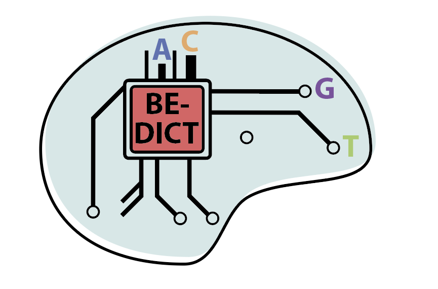

# CRISPRCAS



Repository containing `python` packages for running `BE-DICT` models. There are two packages: 
   - `criscas` for instantiating `per-base` model and 
   - `haplotype` for instantiating `bystander` model. 

For more info about this research, see our [preprint](https://www.biorxiv.org/content/10.1101/2020.07.05.186544v1) on biorxiv.

### Installation

* `git clone` the repo and `cd` into it.
* Run `pip install -e .` to install the repo's python package.

### Using Anaconda (optional) 🐍

The easiest way to install and manage Python packages on various OS platforms is through [Anaconda](https://docs.anaconda.com/anaconda/install/). Once installed, any package (even if not available on Anaconda channel) could be installed using pip. 

#### On Mac 

* Install [Anaconda](https://docs.anaconda.com/anaconda/install/).
* `git clone` the repo and `cd` into it.
* Start a terminal and run

    ```shell
    # create an environment
    conda create --name bedict_crispr
    # activate the created environment (bedict_crispr)
    conda activate bedict_crispr
    # install anaconda
    conda install -c anaconda python=3.7
    # update all installed packages
    conda update -y --all
    # install pytorch 
    # Note cudatoolkit version depends on the version installed on your device
    # if there is no GPU run this command
    # conda install pytorch torchvision -c pytorch
    # see https://pytorch.org/
    conda install pytorch torchvision cudatoolkit=10.1 -c pytorch
    conda clean -ya
    # install criscas package (this package)
    pip install -e .
    ```
* After that we are ready to use the package with the trained `BE-DICT` models for base editing prediction.

### BE-DICT model running demo 🏃‍♀️

We provide two `notebooks` that illustrate the use of BE-DICT (`perbase`) and (`bystander`) models under `demo` folder:
   - [BE-DICT `perbase` model](https://nbviewer.jupyter.org/github/uzh-dqbm-cmi/crispr/blob/master/demo/BEDICT_model_demonstration.ipynb)
   - [BE-DICT `bystander` model](https://nbviewer.jupyter.org/github/uzh-dqbm-cmi/crispr/blob/master/demo/BEDICT_haplotype_model_demoseqs.ipynb)

### OS & Packages' version

The models were trained, tested and ran on Linux machine `Ubuntu 18.04.3 LTS` with one `Tesla P4 GPU` support.
The version of the `required` packages used in `setup.py` were:
* `numpy` &gt;=  `'1.18.1'`
* `scipy` &gt;= `'1.4.1'`
* `pandas` &gt;= `'1.0.1'`
* `scikit-learn` &gt;= `'0.22.1'`
* `torch` &gt;= `'1.7.1'`
  * `cudatoolkit=10.1`
* `matplotlib` &gt;= `'3.1.3'`
* `seaborn` &gt;= `'0.10.0'`
* `prettytable` &gt;= `'2.0.0'`
* `tqdm` &gt;= `'4.56.2'`

### Webapp 🕸️

A running instance supporting `BE-DICT (perbase)` model can be accessed at this [link](http://be-dict.org).

### Citation

If you find our work is useful in your research, please cite the following paper:

> @article {Marquart2020.07.05.186544,  
	author = {Marquart, Kim F. and Allam, Ahmed and Janjuha, Sharan and Sintsova, Anna and Villiger, Lukas and Frey, Nina and Krauthammer, Michael and Schwank, Gerald},  
	title = {Predicting base editing outcomes with an attention-based deep learning algorithm trained on high-throughput target library screens},  
	elocation-id = {2020.07.05.186544},  
	year = {2020},  
	doi = {10.1101/2020.07.05.186544},  
	URL = {https://www.biorxiv.org/content/early/2020/07/05/2020.07.05.186544},  
	eprint = {https://www.biorxiv.org/content/early/2020/07/05/2020.07.05.186544.full.pdf},  
	journal = {bioRxiv}  
}